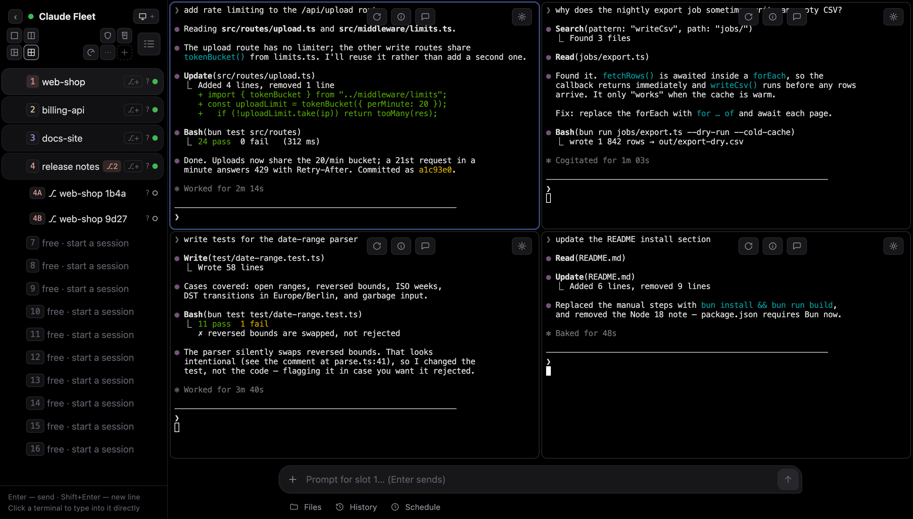

# Claude Fleet

Web dashboard (desktop + mobile) for up to 10 persistent Claude Code tmux sessions on one machine — sidebar with activity dots, native xterm.js scrollback, direct typing into the focused session, a directory picker with recents for starting sessions per project. Fork of [claude-deck](https://github.com/jp290/claude-deck) (single-session phone remote), generalized to a slot registry.



**Requirements:** [Bun](https://bun.sh), tmux, the `claude` CLI, macOS or Linux.

**Quickstart:**
```sh
bun install
bun run build
FLEET_HOST=$(tailscale ip -4) bun server.ts   # defaults to 127.0.0.1 (loopback only)
```
The server prints a one-click login URL (`http://<ip>:8790/?token=…`) on boot when stdout is a terminal — with output redirected to a log (the tmux setup under Ops) it deliberately withholds the token; read it from `fleet.json` instead. Open the URL from any machine on the same private network. The token is stored in a `SameSite=Strict` cookie; you log in once per browser.

## Security model

A reachable fleet is **remote code execution as your user** — every session is a shell. Defenses, in order:

1. **Bind address** — defaults to loopback. Only set `FLEET_HOST` to a private (Tailscale/VPN/LAN) address you trust end-to-end; traffic is plain `ws://`, so on anything but an encrypted overlay network (Tailscale is WireGuard) it's sniffable.
2. **Access token** — required on every API/WebSocket request (`?token=` login URL → cookie, or `Authorization: Bearer`). Generated on first boot and persisted in `fleet.json` (mode 600); override with `FLEET_TOKEN`.
3. **Cross-site guards** — `SameSite=Strict` cookie plus Origin and Host checks block cross-site WebSocket hijacking, CSRF, and DNS rebinding (a malicious website in a tab on the same machine can't reach the fleet, even though WebSockets ignore CORS). If you access the fleet via a hostname (e.g. MagicDNS), add it to `FLEET_ALLOWED_HOSTS=myhost.tailnet.ts.net:8790`.
4. **Session command** — defaults to plain `claude` (with its permission prompts). Unattended mode is an explicit opt-in: `FLEET_CMD='claude --dangerously-skip-permissions'`.
5. Stream files and state are chmod 600/700 (terminal output can contain secrets).

Not provided: TLS, multi-user, rate limiting. For HTTPS + tailnet-identity auth in front, `tailscale serve` works well.

## Architecture — tmux without attach, ×10

Same core as claude-deck (see its README for the full rationale), parameterized per slot:

- tmux socket `claudefleet`, sessions `s1`..`s10`, each created lazily in a directory chosen via the picker (recents are persisted)
- `pipe-pane` per session → `streams/sN.raw`; the Bun server tails all active streams (100ms poll) and broadcasts per-slot over `ws://…/ws/<N>`
- Reconnect/slot-switch replays the last 2 MB of that slot's stream
- Per-slot input promise chains and per-slot tmux paste buffers (`fleetbufN`) — one hung session can't stall input to the others, and concurrent sends can't race
- `fleet.json` persists slot→cwd + recents + token (writes serialized). Self-heal (2s loop) recreates any *activated* slot whose pane died; **kill via the UI ✕ removes the slot from state first**, so killed slots stay dead. External `kill-session` on an active slot = crash → resurrected. Server restart re-adopts slots from `fleet.json` plus any stray `sN` tmux sessions.

## Mobile

Below 700px viewport width (or a coarse-pointer device in short landscape) the same page switches to a phone layout — one shared codebase, no separate build:

- **App bar + drawer** — ☰ opens the session list (same slots UI as the desktop sidebar); tapping a slot switches and closes it. Title shows the focused session, dot shows WS state. On touch there's no hover, so each row's ✎ rename and ✕ delete icons are pinned visible and finger-sized — you can rename or kill a session straight from the phone (✕ still guards with a confirm).
- **Key row** — `esc ⇥ ⇧⇥ ↑ ↓ ← → ⏎ ^C` buttons send raw bytes over the WS, covering everything Claude Code's TUI needs (interrupt, mode cycle, menu navigation) that virtual keyboards lack.
- **Live typing (⌨)** — the toggle left of the compose box opens a dedicated input that relays every keystroke straight to the focused pane's pty — characters plus Enter/Esc/Backspace/Tab/arrows. Uses a real visible field, not xterm's hidden textarea (unreliable on iOS: keyboard often won't open, autocorrect swallows input); a sweeper keeps the field empty and `beforeinput`/`compositionend` handling makes IME and dictation work. Tap ⌨ again to exit; leaving mobile width auto-disables it.
- **Compose** — for longer prompts: Enter inserts a newline on mobile (messaging convention); ➤ sends. Inputs are 16px so iOS doesn't zoom on focus.
- **Keyboard-safe layout** — app height tracks `visualViewport` (plus `dvh`/`interactive-widget`), so the compose/live bar rides above the on-screen keyboard; safe-area insets handled for notch/home-indicator. The terminal's own hidden textarea gets `inputmode=none` so *tapping the terminal* never pops the keyboard; direct input is opt-in through the ⌨ live bar instead. The viewport handler debounces before refitting (~200ms) — the keyboard's predictive-text bar toggles the visual viewport height in a burst while typing, and refitting on every micro-wobble was triggering spurious `/resize` calls mid-keystroke.
- **Scrollback** — touch-drag scrolling is xterm.js's own gesture handler (`Viewport.handleTouchStart`/`handleTouchMove`, not native browser scrolling — `.xterm-viewport` already ships `overflow-y: scroll`); a native viewport-scroll listener keeps the ▼ jump-to-bottom pill in sync since xterm's `onScroll` doesn't fire for it. Known caveat: xterm gates that handler on `!coreMouseService.areMouseEventsActive`, so a subprocess that enables terminal mouse-reporting (a pager, `lazygit`, etc.) can silently turn touch-drags into mouse clicks instead of scroll until it's disabled again. Cross-width scrollback reflow (connecting at a different width than the pane's current one) is handled by the server's width-reseed path — see "Scrollback fidelity across widths" below for what it fixes and its one remaining gap.
- **Canvas renderer** — xterm without a rendering addon falls back to its DOM renderer, which paints every visible cell as a real DOM node; a busy Claude session streaming output while the terminal is being scrolled means frequent DOM churn competing with the scroll gesture for the main thread, especially on mobile Safari. `@xterm/addon-canvas` paints to a `<canvas>` instead, which is xterm's own recommended upgrade path for this. Loaded on both desktop and mobile panes.
- **No disruptive resize jiggle on no-op resizes** — `/resize` forces the tmux pane through a shrink-then-grow redraw (`repaint()`) so stubborn TUIs reflow; without a same-size guard, this fired on every `/resize` call including ones the client sends for a size it already reported, blanking the bottom (active-input) row for ~200ms while typing. The server now skips the jiggle when the requested size matches the pane's current size.
- **Installable** — web manifest + icons; "Add to Home Screen" gives a standalone full-screen app. Terminal font drops to 11px (~50 cols portrait). Resizes still follow last-writer-wins across clients, same as two desktop windows.

## Client (desktop)

- xterm.js stdin is **enabled**: click the terminal and type; keystrokes relay raw over the WS (chunked ≤1000 B). ⌘C/⌘V work natively.
- **⌃1–⌃0** switches slots (⌘+digit is reserved by macOS browsers for tab switching — don't "fix" this back to ⌘).
- Compose box for long prompts: Enter sends (bracketed paste + Enter server-side), ⇧Enter = newline. Command-prefix chips are opt-in via `FLEET_CHIPS=/cmd1,/cmd2` (default: hidden).

### Bundled chips: /sharpen and /gosharp

Two general-purpose Claude Code slash commands ship in [`commands/`](commands/) as a working chips demo (canonical home: [jp290/sharpen](https://github.com/jp290/sharpen)):

- **`/sharpen`** — prompt compiler: reshapes a rough prompt into the right context plus only the discipline the task needs; executes it only on clear "do this" intent
- **`/gosharp`** — executor: does the work under sharpened discipline (visible restatement of intent, free self-checks, argue-against-your-own-conclusion before finalizing)

Install them user-wide so every fleet session can invoke them, then surface them as chips:
```sh
cp commands/*.md ~/.claude/commands/
FLEET_CHIPS='/sharpen,/gosharp' bun server.ts
```
- Rename a session via the ✎ icon or double-clicking its name (Enter saves, Esc cancels, blank resets to the folder name). Labels persist in `fleet.json` and die with the session. The ✎/✕ icons overlay the row's right edge on hover only, so labels get the full sidebar width the rest of the time.
- **Collapse toggle (‹/›)** in the header shrinks the sidebar to a ~50px rail (slot numbers + activity dots) to hand the width to the terminals; click again to restore. State persists in localStorage; it's a desktop-only affordance (on mobile the sidebar is the ☰ drawer).
- Sidebar polls `/api/sessions` every 2s; green dot = output within 5s (timestamps compared against server `now` to dodge clock skew). DOM only re-renders on actual change.
- Last-viewed slot and sidebar-collapsed state are restored from localStorage on reload.

## Ops

```sh
tmux -L claudefleet new-session -d -s srv 'cd ~/claude-fleet && FLEET_HOST=<ip> exec bun server.ts >> server.log 2>&1'   # start
tmux -L claudefleet kill-session -t srv    # stop (claude sessions survive)
bun run build                              # rebuild client after editing src/client.ts
FLEET_E2E_HOST=<ip> bun fleet-e2e.ts       # e2e suite: creates slots 1+2, kills them, restarts srv
```

Env: `FLEET_HOST` (default `127.0.0.1`), `FLEET_PORT` (8790), `FLEET_TOKEN`, `FLEET_ALLOWED_HOSTS`, `FLEET_CMD`, `FLEET_CHIPS`.

## Pinned: xterm 5.5.0, NOT 6.x

Inherited from claude-deck (6.x removed the overflow-scroll viewport). Desktop probably tolerates 6.x, but don't upgrade without testing scroll + stdin.

## Known limits

- `streams/*.raw` grow unbounded (~KB/interaction; killing a slot deletes its stream)
- One terminal size per session, last resize wins — fine for a single client; a second browser window fights over size
- **Scrollback fidelity across widths** — when a connecting client's width differs from the pane's, the server resizes the tmux window and re-seeds from a fresh plain-text `capture-pane` (tmux reflows history on resize, so this replays correctly-wrapped text instead of the raw stream's stale wrapping). `capture-pane`'s text output separates rows with a bare LF, never a CR; xterm.js doesn't treat LF alone as "return to column 0", so any captured line shorter than the pane's width used to leave the cursor short and stagger everything after it — this, not any inherent tmux/rendering limitation, was the cause of the severe garbling (including in content drawn with absolute cursor addressing, like Claude Code's own onboarding banner, which reflows fine once every row is properly CRLF-terminated). Both `capture-pane` call sites now normalize to CRLF before anything reaches a terminal. `/resize` also force-repaints so the live screen redraws immediately instead of waiting on the app's own SIGWINCH handling. One real gap remains: it's still one shared pty width — a second connecting client (or the same client at a new width) resizes the pane for everyone, so simultaneous phone+desktop viewers of the same slot still fight over live width. A true per-client fix would need a per-client VT-emulated render, not attempted here.
- Kill ✕ is destructive (session + scrollback gone) behind a `confirm()` only
- Single shared token, no TLS, no rate limiting — the private network is part of the trust boundary
