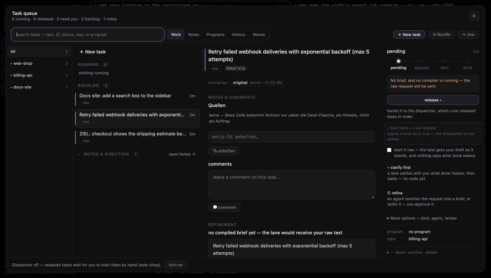
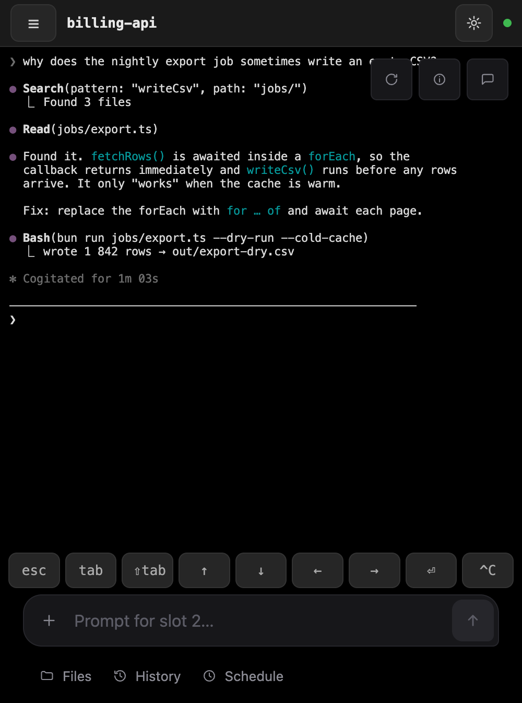

# Claude Fleet

**Run a whole team of coding agents from one browser tab — and let nothing reach `main` that
didn't pass your tests.**

Claude Fleet is a self-hosted dashboard for Claude Code, Codex and Pi. Every agent lives in a
persistent tmux session on the machine running the server, so closing the tab doesn't kill it.
Hand an agent a task and it works in its own git worktree; when it's done, the server — not the
agent — rebases, runs your verify command and lands the branch only if it passes.


## Why

- **Many agents, one screen.** Up to 16 sessions in a 1–4 pane grid, with live terminals you can
  type into, activity dots, and a structured chat view of each agent's transcript.
- **Parallel without chaos.** Each task runs in an isolated *lane* — a throwaway worktree on its
  own branch — so agents never edit the same checkout.
- **A gate the agent can't talk its way past.** Landing is a server-side job: rebase, run your
  verify command under a machine-wide lock, fast-forward `main` only on green. Conflicts go to a
  resolver agent and then wait for your review. The last land in a repo can be undone as long as
  `main` hasn't moved or been pushed since.
- **A queue, not a chat log.** File tasks, release them when you're ready, and let the dispatcher
  start lanes for them — or start each one by hand.
- **Works from your phone.** The same page becomes a mobile layout with a key row
  (esc, tab, arrows, ^C) and a prompt bar.

<p>


</p>

<sub>Screenshots come from a throwaway instance with canned agent output.</sub>

## Quickstart

You need [Bun](https://bun.sh), tmux, macOS or Linux, and at least one agent CLI on your `PATH`
(`claude` by default).

```sh
git clone https://github.com/jp290/claude-fleet.git
cd claude-fleet
bun install
bun run build
bun server.ts
```

The server listens on `127.0.0.1:8790` and prints a login link that carries your access token.
Open it — the token is stored in a cookie, so you log in once per browser.

Then:

1. **Start a session.** Click a free slot, pick a directory, and an agent starts there.
2. **Start a lane.** In a git repo, use the `⎇+` button (or *new lane* in the directory picker).
   The agent gets its own worktree and branch.
3. **Land it.** When the lane has committed its work, open the ⓘ info column and press
   **Land lane**. The server rebases, runs your verify command and fast-forwards `main` on green.
4. **Queue work.** Open the task queue, write what should be true when the task is done, and
   **release** it. With `FLEET_DISPATCH_REPO` set and the dispatcher switched on, released tasks
   start lanes by themselves.

Tell the gate how to test your code with `FLEET_VERIFY_CMD` (for example
`FLEET_VERIFY_CMD="bun test"`). Without it, any lane that rebases cleanly lands unverified.

## Configuration

Everything is set through environment variables. The most useful ones:

| Variable | What it does |
|---|---|
| `FLEET_HOST`, `FLEET_PORT` | Bind address and port. Default `127.0.0.1:8790`. |
| `FLEET_TOKEN` | Fixed access token instead of the generated one (stored in `fleet.json`). |
| `FLEET_ALLOWED_HOSTS` | Hostnames the dashboard may be reached under, e.g. a Tailscale name. |
| `FLEET_CMD` | The agent command for the Claude adapter. Default `claude`, with its own permission prompts. |
| `FLEET_VERIFY_CMD` | The command that must pass before a lane lands. |
| `FLEET_POSTLAND_AUDIT_CMD` | Optional slower suite, re-run against `main` after each land. |
| `FLEET_DISPATCH_REPO` | Repo the dispatcher starts lanes in for released tasks. |
| `FLEET_DISPATCH_MAX_LANES` | How many lanes the dispatcher runs at once (default 3). |
| `FLEET_SHARE_HOSTS` | Hostnames for read-only share links (see [SHARING.md](SHARING.md)). |

For an always-on setup, run the server under the included watchdog (`watchdog.sh`, with
`launchd-example.plist` or `fleet-watchdog.service`), so it survives crashes and reboots.

## Security — read this first

A reachable fleet is **remote code execution as your user**: every session is a shell.

- It binds to loopback by default. Only expose it on a network you trust end to end, such as
  Tailscale or WireGuard — traffic is plain HTTP/WebSocket, there is no TLS.
- There is one owner token, no user accounts, and no rate limit on the owner API.
- Each session gets its own scoped token that can only act on its own slot.
- Share links are view-only, password-protected, and served on separate hostnames.
- The Claude adapter keeps Claude Code's permission prompts unless you change `FLEET_CMD`. The
  Codex adapter always runs with `--dangerously-bypass-approvals-and-sandbox`, and Pi has no
  permission layer — choose your harness knowing that.

## How it works

```
task ──release──▶ queued ──dispatch──▶ lane (worktree + agent) ──report──▶ land ──▶ audit
                                             │                              │
                                     commits on its branch      rebase → verify → fast-forward main
```

- **Slots** are 16 fixed places, each backed by a tmux session. A dead pane is rebuilt and, where
  the agent supports it, resumed in the same conversation.
- **Harness adapters** describe how each agent runs: Claude Code, several Pi variants, a
  containerised one, and Codex.
- **Programs** group tasks under one supervising "main" session that can file, release and land
  its own work within limits you set.
- **Ledgers** (JSONL files) record what every lane was given, what it reported, and what landed.

The full picture — every object, the lifecycle of a task, the trust model, with pointers into the
code — is in [docs/architecture.md](docs/architecture.md). Agents working *on* this repo follow
[AGENTS.md](AGENTS.md).

## Status

A personal project, used daily on real repositories, and moving fast. Expect rough edges:

- The web UI is English with some German left in places.
- Only one suite runs at a time per machine, so lands can queue behind each other.
- One terminal size per session — two browsers on one slot fight over width.
- Terminal logs (`streams/*.raw`) grow without bound.

More in [docs/architecture.md](docs/architecture.md#known-limits).

## License

MIT. Grew out of [claude-deck](https://github.com/jp290/claude-deck).
