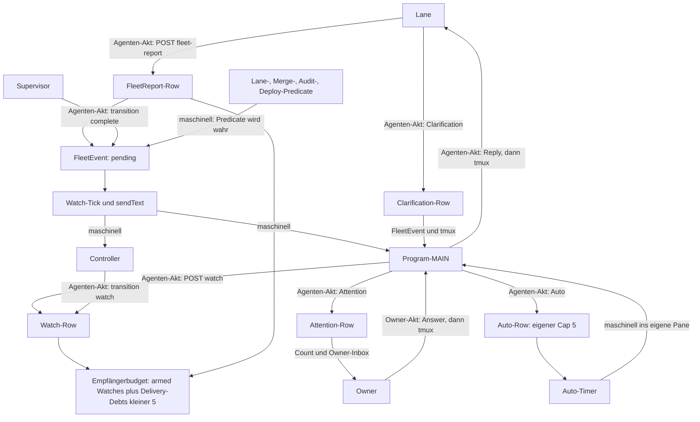

# System-Map des Fleets — Ist-Stand 2026-08-25

Messnotiz. Gegenstand sind die heute implementierten Datenströme zwischen Rollen sowie Informations- und Arbeitsschichten. `MASCHINELL` bedeutet: Der Server stellt ohne einen weiteren Agenten-Akt zu. `AGENTEN-AKT` bedeutet: Eine Rolle muss lesen, entscheiden, eine Route aufrufen oder Git bedienen. `VERIFIZIERT` bezeichnet einen punktuell gelesenen Code-/Routenbeleg; `UEBERNOMMEN` eine Aussage aus der genannten Messnotiz oder Referenz. Abgeschaltete, aber weiterhin implementierte Pfade sind als `AUS` markiert. Vorschläge und Zielbilder sind nicht Teil dieser Karte.

Abstraktionsurteil: Diese Karte soll existieren, weil Rollen, Transporte und persistierte Fakten getrennte Dinge sind und der Owner nur an ihren belegten Kanten erkennen kann, was von selbst weiterläuft und was auf einen Menschen oder Agenten wartet.

## 1. ROLLEN-INVENTAR

| Rolle | Liest | Schreibt | Credential-Klasse | Beleg |
|---|---|---|---|---|
| **Owner** | Board-Projektionen aus `GET /api/sessions`, vollständige Programme/Tasks, Attention-Inbox, Audit-/Deploy-Ledger und Pane-Streams | Owner-Routen für Program-Vorschlag, Confirm, Activate, MAIN-Bootstrap, Promotion, Task-Freigabe, Land, Audit-Adjudikation und Deploy; außerdem Eingaben in Panes | **Owner-Token** | `server.ts:15638-15735`, `server.ts:19192-19260`, `server.ts:20512-20535` — `VERIFIZIERT` |
| **Controller-MAIN** | eigene Session über `GET /api/self`, eigene Program-Vorschläge über `GET /api/self/programs`, zugestellte Transition-Events und Panes, die es bewusst öffnet | Program-Vorschläge, Transition-Watches, Pane-Bericht an den Owner; keine Owner-Route und keine persistierte Controller-Bindung | **Self-Token** | `AGENTS.md` → „Role contract — four levels“; `server.ts:18515-18633` — `VERIFIZIERT` |
| **Program-MAINs** | owner-bestätigtes Program, `GET /api/self/program-execution`, eigene Reports/Clarifications/Attention, eigene Watches/Events, Lane-Diff und Verifikationsbelege | Program-Tasks zunächst `pending`, deren Release, Clarification-Antworten, Watch-Abos, Attention-Requests, bei Promotion Self-Land; kleine In-Scope-Änderungen auch direkt im MAIN-Checkout | **Self-Token** | `AGENTS.md` → „Role contract — four levels“; `docs/self-api.md` → „Program-MAIN-Ausführungsschiene“ — `UEBERNOMMEN` |
| **Lanes** | zugestellten Brief im eigenen Pane, isolierten Worktree, `GET /api/self`, `GET /api/self/drift`, `GET /api/self/gate`, eigene Reports/Clarifications | Dateien und Commit auf dem Lane-Branch; typed Fleet-Report, Clarification oder Criterion-Vorschlag; keine Release-, Watch-, Attention- oder Land-Autorität | **Self-Token** | `server.ts:18720-18977`; `AGENTS.md` → „Role contract — four levels“ — `VERIFIZIERT` |
| **Steward** | `GET /api/steward/digest`, Session-/Gate-/Deploy-Fakten, kurze Brief-/Transcript-Projektionen, Dispositions-, Audit- und Lane-Outcome-Ledger | begrenzte Sends, Autos, Rundgang-/Inspektionsjournal und ausschließlich `pending` Task-Vorschläge; die Deploy-Route ist technisch erreichbar, der aktuelle Rollenvertrag verbietet ihren Aufruf | **Self-Token plus separates Steward-Token** | `server.ts:18192-18410`; `docs/messungen/autonomie-tueren-2026-08-25.md` → „D17“ — `VERIFIZIERT` |
| **Supervisor** | eigenes `GET /api/self`, alle Program-Inhalte, `GET /api/self/supervisor-view`, offene Transition-Watches und Fleet-Fakten | Program-Vorschläge, begrenzte Nudges an gebundene Program-MAINs, Abschluss eines Controller-Transition-Watches; kein Land, Deploy oder owner-seitiger Attention-Kanal | **Self-Token** | `server.ts:15099-15385`, `server.ts:18599-18670`; `docs/messungen/system-analyse-review-2026-08-25.md` → „Verdikte“ — `VERIFIZIERT` |
| **Wegwerf-Worker: Analyst** | Task-Text, Queue-/Repo-/Lane-Fakten | `Task.analysis` in `fleet.json` und `analysis-verdicts.jsonl`; die Live-Instanz startet diesen Pfad nicht (`FLEET_ANALYSIS_MS=0`) | **keine** | `server.ts:7700-8055`, `watchdog.sh:148`; `docs/queue-analyst.md` → „7. Die Dispatcher-Betriebsreferenz“ — `VERIFIZIERT` |
| **Wegwerf-Worker: Brief-Kompiler** | Task, Analyse und begrenzten Repo-Kontext | `Task.brief` in `fleet.json`; die Live-Instanz startet diesen Pfad nicht, weil Analyse/Compiler aus sind | **keine** | `server.ts:7744-8055`, `server.ts:16545-16549`, `watchdog.sh:148` — `VERIFIZIERT` |
| **Wegwerf-Worker: Reviewer** | Diff, Brief, Git-/Lane-Provenienz und begrenzten Kontext | ephemeres Review-Verdikt; bei späterem Land fließen relevante Fakten in Merge-/Outcome-Provenienz. Auto-③ ist advisory; Clean-Review ist live `off` | **keine** | `server.ts:9611-9813`, `server.ts:10579-10588`; `docs/harness-adapter.md` → „auto-③“ — `VERIFIZIERT` |
| **Wegwerf-Worker: Merge-Worker** | Konfliktdateien, Brief und Merge-Kontext | ausschließlich den konfliktbehafteten Lane-Worktree; sein Ergebnis geht zurück an `mergeJob` und danach durch Verify | **keine** | `server.ts:12994-13121`; `docs/harness-adapter.md` → „Repo-Worker“ — `VERIFIZIERT` |
| **Watchdog** | Prozess-/tmux-Zustand und seine Startkonfiguration | startet die `srv`-tmux-Session mit Runtime-Flags und schreibt `server.log`; entscheidet keine Tasks, Lands oder Deploys | **keine** | `watchdog.sh:94-109`, `watchdog.sh:148` — `VERIFIZIERT` |
| **Server/Ticks** | `fleet.json`, Git, Pane-Streams, Prozesszustand, Queue und Ledger | abgeleitete Live-Sichten, FleetEvents, Pane-Zustellungen, Persistenz, Audit-/Deploy-/Outcome-Zeilen sowie Server-Jobs | **keine** als interner Prozess; prüft Credentials an den Routen | `server.ts:16531-16558`; `server.ts:18515-19032` — `VERIFIZIERT` |
| **Dispatcher** | `kind=auftrag,status=queued`, Repo-Ziel, Caps, Runtime-Schalter sowie vorhandene Analyse/Brief-Fakten | Worktree, Lane-Slot, Branch, `Task.status=sent`, Gründungsbrief und Context-Receipt; weder Land noch Deploy | **keine**; Bestandteil des Server-Ticks | `server.ts:7310-7649`, `server.ts:8184-8338`; `docs/queue-analyst.md` → Abschnitt 7 — `VERIFIZIERT` |

Credential-Fußnote: Die verlangte Dreiteilung Owner/Self/keine beschreibt fast alle Rollen, aber nicht den aktuellen Steward. Der Code prüft für `/api/steward/*` ein eigenes `x-fleet-steward-token`; der Steward-Pane besitzt daneben wie jede Session einen Self-Token (`server.ts:19023-19032`). Diese vierte technische Klasse wird deshalb nicht in eine der drei anderen umetikettiert.

## 2. SCHICHTEN-INVENTAR

| Schicht | Ist-Inhalt | Wer liest | Wer schreibt | Haltbarkeit / Autorität | Beleg |
|---|---|---|---|---|---|
| **Code (`server.ts`, `src/`)** | Routen, Zustandsmaschinen, Adapter, Ticks und Client; `public/` ist das gebaute Client-Artefakt | Server/Bun, Build, Agenten und Owner bei Review | Lanes oder Program-MAIN innerhalb ihres Write-Sets; Merge/Land bewegt anschließend `main` | Git-versioniert; laufender Server und Bundle können hinter `HEAD` liegen | `server.ts:17444-17468`; `AGENTS.md` → „Shared vocabulary“ — `VERIFIZIERT` |
| **Live-Sensoren (`GET /api/sessions`, `GET /api/self`, Panes)** | kompakte Owner-Projektion; exakt eigene Session mit Autos/Watches/Events; tmux-Ausgabe über Capture/Stream/WebSocket | Owner, jeweilige Session, Steward/Supervisor über ihre engeren Projektionen | Server berechnet Projektionen; Harness schreibt Pane-Ausgabe; Owner/Server senden Pane-Eingaben | flüchtige Beobachtung, keine Promotion und kein Beweis für Arbeitsqualität | `server.ts:18515-18560`, `server.ts:19192-19260`, `server.ts:21292-21385` — `VERIFIZIERT` |
| **Queue + Zustand (`fleet.json`)** | Slots, Tasks, Programs samt `main {slot,openedAt,sessionId,boundAt}`, Autos, Watches, Events, Reports, Attention, Undo-/In-flight-Zustand und Owner-Token | Server beim Boot und bei Projektionen; Rollen nur durch begrenzte Routen | Owner-Routen, Self-Routen, Steward-Routen und Server-Ticks über `saveState` | mutable Betriebswahrheit; `0600`, nicht Wissensdokument | `server.ts:75`, `server.ts:2181-2203`, `server.ts:3517-3518`, `server.ts:15901-16086` — `VERIFIZIERT` |
| **Ledger** | `lane-outcomes.jsonl`: terminale Lane-Fakten; `post-land-audits.jsonl`: Tier-2-Ergebnis; `audit.jsonl`: Betriebsakte; `deploys.jsonl`: Build/Restart-/Boot-Verdikte | Owner-Routen, Steward-Whitelist, spätere Audits | ausschließlich Server-Chokepoints per Append | append-only/rotierend; Beobachtung vor Label, fehlende Zeile bleibt `unknown` | `server.ts:86-120`, `server.ts:12444-12449`, `server.ts:11839-11849`, `server.ts:17488-17520` — `VERIFIZIERT` |
| **Wissens-Regal (`docs/`, Commit-Bodies, `refs/notes/fleet/land`)** | aktuelle Referenzen und datierte Messnotizen; agentengeschriebene Commit-Beschreibung; servergeschriebene Land-Provenienz am integrierten Tip | Owner, MAINs, Reviewer, spätere Sessions | Agenten schreiben Docs/Commit; Server schreibt Land-Note best effort | Docs/Commit Git-versioniert; Note verändert keinen SHA und wird nicht standardmäßig gepusht | `server.ts:11228-11394`; `AGENTS.md` → „Observations precede labels“ — `VERIFIZIERT` |
| **Regelwerk (`AGENTS.md`, `CLAUDE.md`-Render)** | portable, getrackte Rollen-/Invariantenbasis plus host-/publikumsspezifischer, git-ignorierter Render | jede gegründete Session über Loader/Gründungsbrief; Claude liest den portablen Kern über den Render | `AGENTS.md` normal per Git; `CLAUDE.md` nur über `rulebook.ts`-Fragmente und Renderpfad | normative Regeln; Code und Live-Sensoren gewinnen bei Ist-Fakten, portable Invarianten bei dauerhaften Regeln | `AGENTS.md:22-118`; `rulebook.ts` → `RULEBOOK_FRAGMENTS` — `UEBERNOMMEN` |
| **Übergabe (`HANDOFF.md`)** | oberster Übergabeabschnitt plus optionaler kurzer `carry` im Successor-Brief | Nachfolger nach `state.sh`/`register.sh`; Server prüft nur Existenz, Cleanliness und Commit-Zeit | abzulösende MAIN-/Supervisor-/plain Session schreibt und committet | Git-versionierte Zustandsübergabe; muss nach `openedAt` committet sein | `server.ts:5798-5847`; `docs/self-api.md` → „succeed / retire“ — `VERIFIZIERT` |

Die Schichten haben keine gemeinsame Wahrheitsstufe: Code und Live-Sensoren beschreiben den laufenden Mechanismus, `fleet.json` den mutablen Betriebszustand, Ledger vergangene Serverakte, und das Wissens-Regal die erklärende beziehungsweise Git-gebundene Geschichte. Ein Pane-Text ist Zustellung; ein typisierter Row oder Git-Beleg ist die dazugehörige überprüfbare Spur.

## 3. STROM-MATRIX

Richtung: `↓` Owner/Planung → Ausführung, `↑` Ausführung → Koordination/Owner, `↔` Antwortkreis, `→` seitlich oder schichtintern. „Agenten-Akt startet; maschinell liefert“ heißt: Ohne den ersten Aufruf entsteht nichts, danach übernimmt der Server den Transport.

| ID | Quelle → Senke | Transport | Auslöser | Richtung | Zustellung oder erforderlicher Akt | Beleg + Tag |
|---|---|---|---|---|---|---|
| P01 | Serverzustand/Git/Panes/Ledger → Owner-Board | `GET /api/sessions` plus gezielte Owner-GETs | 2-s-Client-Poll beziehungsweise geöffnetes Detail | ↑ | **MASCHINELL** projiziert; Owner muss die Fakten lesen und bewerten | `server.ts:19192-19260`; `src/client.ts:5084` — **VERIFIZIERT** |
| P02 | Owner → beliebiges Session-Pane | Browser-WebSocket → tmux `send-keys` | Owner tippt/sendet | ↓ | **AGENTEN-AKT**; Transport danach maschinell | `server.ts:21380-21410` — **VERIFIZIERT** |
| P03 | Controller-MAIN/plain Session → Program-Row | `POST /api/self/programs` → `fleet.json` | Agent formuliert Program-Vorschlag | ↓ | **AGENTEN-AKT**; Server bindet `proposedBy` an die Session-Identität | `server.ts:18607-18633` — **VERIFIZIERT** |
| P04 | Owner → Program-Row | `POST /api/programs/:id/confirm`, danach `/activate` | Owner-Akt | ↓ | **AGENTEN-AKT (OWNER)**; keine automatische Confirmation/Activation | `server.ts:15702-15735` — **VERIFIZIERT** |
| P04a | Owner → Self-Land-Promotion am Program | `POST /api/programs/:id/promotion` → `fleet.json`/Audit | Owner gewährt oder widerruft die Policy | ↓ | **AGENTEN-AKT (OWNER)**; einzige Promotion-Tür, ohne sie bleibt Self-Land default-deny | `server.ts:15649-15694`; `docs/self-api.md` → „promotion“ — **VERIFIZIERT** |
| P05 | Owner + aktives Program → Program-MAIN-Pane und Binding | `POST /api/programs/:id/bootstrap-main` → `openSlot` → `sendText`; Persistenz in `fleet.json` | Owner-Akt | ↓ | **AGENTEN-AKT startet; MASCHINELL liefert** Gründungsbrief und schreibt `main {slot,openedAt,sessionId,boundAt}` | `server.ts:15502-15630` — **VERIFIZIERT** |
| P06 | lebender Slot/Codex-Session-Fakt → Program-Binding | serverinterner Backfill in `fleet.json` | Session-ID wird nach Boot/erstem Prompt beobachtbar | → | **MASCHINELL**; fehlende `sessionId` wird bei passendem `slot+openedAt` nachgetragen | `server.ts:6421-6432` — **VERIFIZIERT** |
| P07 | Program-/Task-/Merge-/Audit-Zustand → Program-MAIN | `GET /api/self/program-execution` | MAIN liest vor einem Akt | ↑ | **AGENTEN-AKT (ABRUF)**; Route actuates nichts | `server.ts:2405-2484`, `server.ts:18636-18643` — **VERIFIZIERT** |
| P08 | Program-MAIN → pending Task | `POST /api/self/tasks` → `fleet.json` | MAIN zerlegt das Program | ↓ | **AGENTEN-AKT**; erzeugt nur `pending` | `server.ts:18791-18805`; `docs/self-api.md` → „tasks“ — **VERIFIZIERT** |
| P09 | Program-MAIN → queued Task | `POST /api/self/tasks/:id/release` → `fleet.json` | separater MAIN-Akt | ↓ | **AGENTEN-AKT**; Antwort ist Queue-Fakt, noch keine Lane | `server.ts:6466-6482`, `server.ts:18807-18819` — **VERIFIZIERT** |
| Q01 | pending Task + Repo-Fakten → Analyst-Worker → `Task.analysis`/Analyse-Ledger | Timer → Wegwerf-tmux/CLI → `fleet.json` + `analysis-verdicts.jsonl` | Analysis-Sweep | → | **MASCHINELL, aktuell AUS** (`FLEET_ANALYSIS_MS=0`) | `server.ts:7931-8055`, `server.ts:16545`, `watchdog.sh:148` — **VERIFIZIERT** |
| Q02 | Task + Analyse → Brief-Kompiler → `Task.brief` | Timer → Wegwerf-Worker → `fleet.json` | Brief-Sweep | → | **MASCHINELL, aktuell AUS**; vorhandene ältere Briefs bleiben Daten | `server.ts:7744-8055`, `server.ts:16549`, `watchdog.sh:148` — **VERIFIZIERT** |
| Q03 | `kind=auftrag,status=queued` → Lane-Slot/Worktree/Task `sent` | Dispatch-Tick → Git worktree + `openSlot` | Timer, Caps und Gates frei | ↓ | **MASCHINELL**; genau ein startbarer Row pro Tick, kein Land | `server.ts:8184-8338` — **VERIFIZIERT** |
| Q04 | Task-Text/kompilierter Brief + ContextPlan-Anker + Lane-Footer → Lane-Pane | `briefAndSend` → `sendText` | erfolgreicher Dispatch | ↓ | **MASCHINELL** | `server.ts:7486-7649`; `docs/messungen/kommunikationsschichten-2026-08-25.md` → „Schicht 1“ — **VERIFIZIERT** |
| Q05 | Server-Text → Harness-Pane | tmux `load-buffer`/`paste-buffer`, dann genau ein Enter | Brief, Event, Watch, Auto, Nudge oder Antwort ist lieferbar | ↓/↔ | **MASCHINELL**; `canDeliver` entscheidet den aktuellen Transport-Gate | `server.ts:5201-5292`; `docs/messungen/kommunikationsschichten-2026-08-25.md` → „Schicht 2“ — **VERIFIZIERT** |
| Q06 | zugestellter Gründungsbrief → Context-Receipt-Ledger | Datei `context-receipts.jsonl` | Brief erfolgreich gesendet | → | **MASCHINELL**; speichert Auswahl/Hash/Bytes, nicht die Arbeitsqualität | `server.ts:7512-7649`, `server.ts:90-99` — **VERIFIZIERT** |
| W01 | Lane-Agent → isolierter Worktree | Dateioperationen | Agent bearbeitet Brief | ↓ | **AGENTEN-AKT** | `AGENTS.md` → „Role contract — four levels“ — **UEBERNOMMEN** |
| W02 | Lane-Agent → Lane-Branch/Commit-Body | Git Commit | Agent hält Done-Kriterium und Verify für erfüllt | ↑ | **AGENTEN-AKT**; Commit macht Arbeit land-sichtbar, beweist sie aber nicht allein | `AGENTS.md` → „Landing“ und „Reporting“ — **UEBERNOMMEN** |
| S01 | eigene Slot-/Auto-/Watch-/Event-Fakten → Session | `GET /api/self` | Agenten-Akt | ↔ | **AGENTEN-AKT (ABRUF)**; read-only, exakt eigener Occupant | `server.ts:18515-18560` — **VERIFIZIERT** |
| S02 | Lane-Branch/Main/Git-Zustand → Lane | `GET /api/self/drift` | Agenten-Akt, insbesondere vor Done | ↔ | **AGENTEN-AKT (ABRUF)**; frische berechnete Beobachtung | `server.ts:18860-18897` — **VERIFIZIERT** |
| S03 | Runtime-Verify-/Rulebook-/Change-Klassifikation → Lane | `GET /api/self/gate` | Agenten-Akt vor Verifikation | ↔ | **AGENTEN-AKT (ABRUF)**; liefert `localProof.steps`, führt sie nicht aus | `server.ts:18899-18950`; `AGENTS.md` → „Verify“ — **VERIFIZIERT** |
| S04 | Clarify-Lane → founding Task | `POST /api/self/criterion` → `fleet.json`; Owner bestätigt über `/api/tasks/:id/criterion-confirm` | Lane- und später Owner-Akt | ↑/↓ | **ZWEI AGENTEN-AKTE**; Vorschlag ist bis Owner-Confirm nicht bindend | `server.ts:18953-18977`, `server.ts:20854-20873` — **VERIFIZIERT** |
| R01 | Lane-Pane → Server-Stream/Capture → Owner oder Controller beim Öffnen | tmux stream, `capture-pane`, WebSocket | Pane-Ausgabe; Empfänger öffnet/liest Pane | ↑ | **MASCHINELL transportiert; AGENTEN-AKT liest und interpretiert**. Ohne Lesen entsteht kein typisierter Befund | `server.ts:8375-8405`, `server.ts:21292-21385`; `docs/messungen/kommunikationsschichten-2026-08-25.md` → „Schicht 3“ — **VERIFIZIERT** |
| R02 | Lane → `FleetReport`-Row + `FleetEvent` | `POST /api/self/fleet-report` → `fleet.json` | Lane-Agent sendet typed Report | ↑ | **AGENTEN-AKT startet**; Report ändert keinen Task-Status | `server.ts:6137-6190`, `server.ts:18753-18763` — **VERIFIZIERT** |
| R03 | pending `FleetEvent` → gebundenes Program-MAIN-/Watch-Empfänger-Pane | Watch-Tick → `sendText` → tmux | Event liegt pending und Receiver ist lieferbar | ↑ | **MASCHINELL**; persistiert vor Send, danach `delivered` oder `send-uncertain` | `server.ts:5947-6041`, `server.ts:10228-10379` — **VERIFIZIERT** |
| R04 | Report/Event-Row → exakter Sender oder Empfänger | `GET /api/self/fleet-report`, `GET /api/self`; Ack über `/api/self/events/:id/ack` | Agenten-Akt | ↔ | **AGENTEN-AKT (ABRUF/ACK)**; Pane-Text ist nur Transport, Row bleibt Fakt | `server.ts:18515-18560`, `server.ts:18753-18842` — **VERIFIZIERT** |
| R05 | Lane → Program-MAIN-Frage | `POST /api/self/clarifications` → `FleetEvent` → MAIN-Pane | Lane-Agent fragt | ↑ | **AGENTEN-AKT startet; MASCHINELL liefert** | `server.ts:6044-6093`, `server.ts:18739-18750` — **VERIFIZIERT** |
| R06 | Program-MAIN → fragende Lane | `POST /api/self/clarifications/:id/reply` → direkte Pane-Zustellung | MAIN antwortet | ↓ | **AGENTEN-AKT startet; MASCHINELL liefert**; exakte Occupant-Bindung | `server.ts:6192-6270`, `server.ts:18765-18773` — **VERIFIZIERT** |
| R07 | Planungs-Session → Watch-Row | `POST /api/self/watch` → `fleet.json` | Controller/MAIN/Supervisor/Steward abonniert | → | **AGENTEN-AKT**; normale Lane wird 409 abgewiesen | `server.ts:5494-5626`, `server.ts:18720-18736` — **VERIFIZIERT** |
| R08 | Lane-Live/Git-Fakten → `lane`-Watch → FleetEvent → Empfänger-Pane | `laneWatchSignal` → Watch-Tick → tmux | Predicate `done-looking` oder `session-ended` wird wahr | ↑ | **MASCHINELL** nach vorherigem Watch-Akt | `lane-signals.ts:48-62`, `lane-signals.ts:92-95`, `server.ts:10194-10283` — **VERIFIZIERT** |
| R09 | `mergeJob`-Terminalzustand → `merge`-Watch → FleetEvent → Empfänger-Pane | in-memory Merge-Fakt + Watch-Tick + tmux | Merge endet landed/non-landed | ↑ | **MASCHINELL** nach vorherigem Watch-Akt | `server.ts:5673-5690`, `server.ts:10194-10379` — **VERIFIZIERT** |
| R10 | Post-Land-Audit-Row → `audit`-Watch → FleetEvent → Empfänger-Pane | Audit-Ledger-Fakt + Watch-Tick + tmux | passender `repo+mainAfter` liegt vor | ↑ | **MASCHINELL** nach vorherigem Watch-Akt | `server.ts:5725-5743`, `server.ts:11839-11840` — **VERIFIZIERT** |
| R11 | Deploy-Boot-Verdikt → `deploy`-Watch → FleetEvent → Empfänger-Pane | `deploys.jsonl` + Watch-Tick + tmux | passender Deploy-Row liegt vor | ↑ | **MASCHINELL nur nach Watch-Akt**; kein Initiator registriert diesen Watch automatisch | `server.ts:5745-5760`; `docs/messungen/autonomie-tueren-2026-08-25.md` → „D20“ — **VERIFIZIERT** |
| R12 | Controller → Transition-Watch; Supervisor → Abschluss; FleetEvent → Controller-Pane | `/api/self/watch {kind:transition}`; `/api/self/supervisor-watch/:id/complete` | Controller-Akt, später Supervisor-Akt | ↔ | **ZWEI AGENTEN-AKTE**, Event-Zustellung danach **MASCHINELL** | `docs/self-api.md` → „transition“ und „supervisor-watch complete“ — **UEBERNOMMEN** |
| R13 | Session → Auto-Row | `POST /api/self/autos` → `fleet.json` | Agent plant eigenen Check-in | → | **AGENTEN-AKT**; Zielslot wird aus Self-Token abgeleitet | `server.ts:5422-5471`, `server.ts:18582-18597` — **VERIFIZIERT** |
| R14 | fälliges Auto → dieselbe Session | Auto-Timer → `canDeliver` → `sendText` → Pane | Zeitpunkt/Intervall fällig | ↔ | **MASCHINELL**; eigener Cap von fünf aktiven Autos | `server.ts:7133-7279`, `server.ts:16537` — **VERIFIZIERT** |
| R15 | Fleet-/Program-/Lane-Fakten → Supervisor | `GET /api/self/supervisor-view` | Supervisor liest Portfolio | ↑ | **AGENTEN-AKT (ABRUF)** | `server.ts:15099-15276`, `server.ts:18645-18656` — **VERIFIZIERT** |
| R16 | Supervisor → gebundenes Program-MAIN-Pane | `POST /api/self/nudge` → direkte `sendText`-Zustellung | Supervisor entscheidet, dass eine begrenzte Frage nötig ist | ↓ | **AGENTEN-AKT startet; MASCHINELL liefert**; kein Owner-Eskalationsweg | `server.ts:15289-15369`, `server.ts:18657-18662` — **VERIFIZIERT** |
| R17 | Program-MAIN → Attention-Row → Owner-Inbox | `POST /api/self/attention` → `fleet.json`; Count auf `/api/sessions`, Rows auf `GET /api/attention` | MAIN erkennt Owner-Grenze | ↑ | **AGENTEN-AKT**; die Maschine erzeugt keine Owner-Frage aus einem stillen Zustand | `server.ts:6928-6985`, `server.ts:19235-19247`, `server.ts:20512-20528` — **VERIFIZIERT** |
| R18 | Owner → anfragendes Program-MAIN-Pane | `POST /api/attention/:id/answer` → persistierter `send-uncertain`-Marker → `sendText` | Owner antwortet | ↓ | **AGENTEN-AKT (OWNER) startet; MASCHINELL liefert** | `server.ts:7027-7095` — **VERIFIZIERT** |
| R19 | Watch-/Report-Empfängerbudget → Annahme oder 409 | `fleet.json`-Zähler: armed Watches plus Delivery-Debts | Watch-Registrierung oder Fleet-Report | → | **MASCHINELL prüft**, aber ein Agent muss Budget durch Auswahl/Verbrauch freihalten; Obergrenze fünf | `server.ts:5593-5599`, `server.ts:6157-6161`; `docs/messungen/system-analyse-2026-08-25.md` → „B.6b“ — **VERIFIZIERT** |
| L01 | Owner oder promoviertes Program-MAIN → `mergeJob` | Owner-Land-Route oder `POST /api/self/tasks/:id/land` | **Owner-Akt** beziehungsweise erlaubter **MAIN-Akt** | ↓ | **AGENTEN-AKT**; kein Tick ruft den Land-Verb | `server.ts:6610-6813`, `server.ts:13826-13860`; `docs/self-api.md` → „land“ — **VERIFIZIERT** |
| L02 | konfliktbehafteter Merge → Merge-Worker → Lane-Worktree → `mergeJob` | Wegwerf-Worker mit Repo-Tools, danach Verify | Merge-Konflikt im laufenden Land-Job | → | **MASCHINELL gestartet; WEGWERF-AGENT bearbeitet**; Ergebnis entscheidet nicht selbst über Land | `server.ts:12994-13121`, `server.ts:13826-14179` — **VERIFIZIERT** |
| L03 | verifizierter Kandidat → Integrationsbranch `main` | Git im `mergeJob`/`advanceIntegration` | Land-Job passiert alle Gates | ↑ | **MASCHINELL nach Land-Akt** | `server.ts:14140-14179` — **VERIFIZIERT** |
| L04 | erfolgreicher Land → Git-Note + Lane-Outcome + Task `done` | `recordLand`, `refs/notes/fleet/land`, `lane-outcomes.jsonl`, `fleet.json` | `main` wurde bewegt und Lane wird abgebaut | ↑/→ | **MASCHINELL**; Note best effort, Outcome servergestempelt | `server.ts:11228-11394`, `server.ts:4592-4627`, `server.ts:12444-12449` — **VERIFIZIERT** |
| A01 | `recordLand` → Post-Land-Audit-Queue | `post-land-audit-queue.json` + In-memory Queue | jeder Land, der `main` bewegt | → | **MASCHINELL**; Queue wird vor Runner-Start dauerhaft gespiegelt | `server.ts:11372-11393`, `server.ts:11554-11644` — **VERIFIZIERT** |
| A02 | Audit-Queue → isolierter Snapshot → Full Suite | Temp-Worktree/Snapshot → konfiguriertes `e2e-isolated.sh` | Queue-Drain, ein Runner zur Zeit | → | **MASCHINELL**; Live-Konfiguration führt Tier 2 aus | `server.ts:11646-11849`; `watchdog.sh:94-109` — **VERIFIZIERT** |
| A03 | Audit-Runner → `post-land-audits.jsonl` → Audit-Watch/Event/Pane | Append-Ledger, `mintAuditEvents`, Watch-Tick, tmux | Runner endet green/red/unknown | ↑ | **MASCHINELL**; `unknown` bleibt Nicht-Messung | `server.ts:11839-11849`, `server.ts:5725-5743` — **VERIFIZIERT** |
| A04 | nicht-grüner Audit-Row → berechtigtes MAIN-Pane | Audit-Ping-Timer → `sendText` | roter, noch nicht adjudizierter Row; Runtime `FLEET_AUDIT_PING_MS=60000` | ↑ | **MASCHINELL** pingt; Urteil/Rollback bleiben Owner-Akt | `server.ts:9972-10060`, `watchdog.sh:148`; `docs/messungen/autonomie-tueren-2026-08-25.md` → „D14/D15“ — **VERIFIZIERT** |
| A05 | Owner-Urteil → Audit-Side-Ledger | Owner-Adjudikationsroute → `audit-adjudications.jsonl` | Owner klassifiziert red/unknown | → | **AGENTEN-AKT (OWNER)**; ursprüngliches Audit-Ergebnis wird nicht überschrieben | `server.ts:111-118`; `docs/messungen/autonomie-tueren-2026-08-25.md` → „D14“ — **UEBERNOMMEN** |
| D01 | Git-`HEAD`/Boot-Commit/Bundle-mtime → Deploy-Fakten | 10-s-Git-Tick → Cache → `/api/sessions`/Steward-Sichten | Timer | ↑ | **MASCHINELL** beobachtet nur committed tree; `null` bis zur ersten Messung | `server.ts:17444-17468`, `server.ts:16540` — **VERIFIZIERT** |
| D02 | Owner-Verb 2 → Build → Deploy-Marker → Server-Neustart | `POST /api/deploy` → `bun run build` → `deploy-inflight.json` → tmux restart | Owner-Akt; Steward technisch möglich, vertraglich untersagt | ↓ | **AGENTEN-AKT (OWNER)**; kein Tick/Auto/Dispatch zieht den Verb | `server.ts:17488-17545`, `server.ts:17725-17791`; `docs/messungen/autonomie-tueren-2026-08-25.md` → „D17“ — **VERIFIZIERT** |
| D03 | nächster Server-Boot → Deploy-Verdikt → `deploys.jsonl` | Marker lesen, Git/Bundle prüfen, Append | Neustart nach Deploy | ↑ | **MASCHINELL**; der sterbende Request antwortet nur `202/ok:null`, der nächste Boot urteilt | `server.ts:17647-17660`, `server.ts:17804-17808` — **VERIFIZIERT** |
| H01 | Vorgänger-Session → `HANDOFF.md`-Commit | Datei + Git | Session entscheidet sich zur Succession | ↑ | **AGENTEN-AKT**; Datei muss clean und nach `openedAt` committet sein | `server.ts:5814-5847` — **VERIFIZIERT** |
| H02 | committed `HANDOFF.md` + optionaler `carry` → Nachfolger-Pane und neue Binding-Identität | `POST /api/self/succeed` → `openSlot` → Gründungsbrief → spätere Retirement | Vorgänger-Akt | ↔ | **AGENTEN-AKT startet; MASCHINELL liefert/bindet**; Lanes dürfen nicht succeeden | `server.ts:5798-5875`, `server.ts:15421-15500`; `docs/self-api.md` → „succeed / retire“ — **VERIFIZIERT** |
| K01 | `AGENTS.md`/CLAUDE-Render/ContextPlan-Anker → gegründete Session | Loader beziehungsweise Gründungsbrief/Paste | Session-Gründung oder Dispatch | ↓ | **MASCHINELL zugestellt**, danach **AGENTEN-AKT** zum Lesen; Receipt belegt Auswahl, nicht Verständnis | `AGENTS.md` → „Loader boundary“; `server.ts:7512-7649` — **UEBERNOMMEN** |
| K02 | Land-Provenienz → spätere Owner-/MAIN-/Reviewer-Lektüre | `git log --notes=fleet/land` | Server schreibt nach Main-Move; Leser ruft Git auf | ↑ | Schreiben **MASCHINELL**, Lesen **AGENTEN-AKT** | `server.ts:11228-11394` — **VERIFIZIERT** |
| T01 | Watchdog-Sensor → laufender Server mit Runtime-Flags | Shell/tmux `srv` | Watchdog erkennt fehlenden Server | → | **MASCHINELL**; kein Task-/Land-/Deploy-Urteil | `watchdog.sh:94-109`, `watchdog.sh:148` — **VERIFIZIERT** |
| T02 | Pane-Streams/Git/Queue/Timer → Live-Sichten, Events und Jobs | `poll`, Git-, Auto-, Watch-, Dispatch-, Harvest-, Review-, Audit-Ping-Ticks | 100 ms bis 60 s Timer, je Pfad | → | **MASCHINELL**; deaktivierte Sweeps werden gar nicht registriert | `server.ts:16531-16558` — **VERIFIZIERT** |
| X01 | Task/Diff → Reviewer-Wegwerf-Worker → advisory Review-Fakt | Auto-③-Timer oder expliziter Review-Pfad → Wegwerf-tmux | `doneLooking`/Review-Anforderung | ↑ | **MASCHINELL gestartet; WEGWERF-AGENT bewertet**; kein Owner-Label und kein automatisches Land | `server.ts:9611-9813`, `server.ts:16552`; `docs/harness-adapter.md` → „auto-③“ — **VERIFIZIERT** |
| X02 | Steward → Flottenfakten/Ledger beziehungsweise pending Vorschlag | `GET /api/steward/digest`; `POST /api/steward/tasks` → `fleet.json` | Steward-Rundgang | ↑/↓ | **AGENTEN-AKT**; Digest kann Wegwerf-Worker nutzen, Task bleibt zwingend `pending` | `server.ts:18192-18410` — **VERIFIZIERT** |
| X03 | Steward → Session-Pane oder Steward-Journal | `/api/steward/send` → `sendText`; `/api/steward/journal` → JSONL | Steward-Akt | ↔ | **AGENTEN-AKT startet**; Send wird maschinell transportiert, Journal maschinell angehängt | `server.ts:18386-18410` — **VERIFIZIERT** |

Ist-Stand-Fußnoten zu Doc/Code-Abweichungen:

1. Die Messnotizen `system-analyse-2026-08-25.md` und ihr Review beschreiben die fehlende `sessionId`-Heilung als damalige Tür. Der aktuelle Code besitzt `backfillProgramMainSessionId` und schreibt bei passendem `slot+openedAt` die später beobachtete ID zurück (`server.ts:6421-6432`); für diese Karte gewinnt der Code.
2. Der im Auftrag zusammen mit den „Self-API-Lesewegen“ genannte Criterion-Pfad ist kein GET. Aktuell ist er eine zweiteilige Schreibkette: Lane schlägt über `POST /api/self/criterion` vor, der Owner bestätigt separat (`server.ts:18953-18977`, `server.ts:20854-20873`).
3. Der Supervisor-Gründungsbrief nennt `POST /api/self/attention`, aber `openAttention` verlangt eine eindeutige Program-MAIN-Bindung (`server.ts:6928-6962`). Der portable Rollenvertrag und der Review behandeln den Supervisor deshalb korrekt als ohne Owner-Route; ein Nudge erreicht nur ein Program-MAIN.
4. Pane-Capture und typed Fleet-Report sind zwei verschiedene Rückwege. Capture transportiert freie Ausgabe und verlangt einen lesenden Agenten; Fleet-Report persistiert eine typisierte Row und mintet ein Event, verbraucht aber dasselbe Fünferbudget wie Watches.

## 4. DIAGRAMME

Arbeitskreis; durchgezogene Pfeile sind Transporte, gestrichelte Pfeile markieren den nächsten nötigen Rollenakt:

```mermaid
flowchart LR
    O["Owner: Ziel und Program-Promotion"]
    P["Program-MAIN: kleinster Act"]
    Q["fleet.json: pending dann queued"]
    L["Lane: Worktree, Verify, Commit"]
    R["Report/Event im MAIN-Pane"]
    M["Land-Route und mergeJob"]
    G["Git main plus fleet/land Note"]
    AQ["Post-Land-Audit-Queue"]
    AU["e2e-isolated und post-land-audits.jsonl"]
    DP["Deploy-Verb 2, Marker, Neustart"]
    DL["deploys.jsonl: Boot-Verdikt"]

    O -->|"Confirm, Activate, Bootstrap"| P
    P -->|"POST self/tasks und release — Agenten-Akt"| Q
    Q -->|"Dispatch-Tick, briefAndSend, tmux"| L
    L -->|"POST fleet-report, FleetEvent, tmux"| R
    R -.->|"MAIN prüft Diff und Belege; Land-Akt"| M
    M -->|"Verify und advanceIntegration"| G
    G -->|"recordLand"| AQ
    AQ -->|"Queue-Drain"| AU
    AU -->|"Audit-Watch, FleetEvent, tmux"| P
    G -.->|"Owner-Akt; kein Auto"| DP
    DP -->|"nächster Boot urteilt"| DL
    DL -->|"GET deploys / Board-Fakt"| O
```

Rückkanäle und die beiden getrennten Fünferdeckel:

